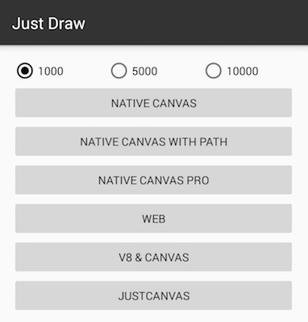

# JustDraw

Canvas绘制test测试Demo，点击下方ICON下载Apk。

单个图形如下图所示：

* 长度为300的线
* 边长为20的正方形
* 直径为2的圆

可选择绘制1000、5000、10000次，查看不同绘制方式的效果及逻辑执行时间。

## 绘制逻辑

### Native Canvas

View的`onDraw(Canvas canvas)`方法中循环执行Canvas绘制，单次绘制如下：

	canvas.drawLine(x, y, x + 300, y, mPaint);
	canvas.drawRect(x, y, x + 20, y + 20, mPaint);
	canvas.drawCircle(x, y, 2, mPaint);

### Native Canvas with Path

View的`onDraw(Canvas canvas)`方法中循环执行Path绘制，单次绘制如下：

	path = new Path();
	path.moveTo(x, y);
	path.lineTo(x + 300, y);
	
	path.addRect(x, y, x + 20, y + 20, Path.Direction.CW);

	RectF rectF = new RectF(x - 2, y - 2, x + 2, y + 2);
	path.addArc(rectF, 0, (float)(360 / Math.PI * 180));

	canvas.drawPath(path, mPaint);

### Native Canvas Pro

先将图形绘制到Bitmap中，再在`onDraw(Canvas canvas)`方法中绘制该Bitmap。

### Web

在WebView中进行Canvas绘制，JS代码中单次绘制如下：

	ctx.beginPath();
	ctx.moveTo(x, y);
	ctx.lineTo(x + 300, y);
	ctx.closePath();

	ctx.rect(x, y, 20, 20);

	ctx.arc(x, y, 2, 0, 360, false);

	ctx.stroke();

### V8 & Canvas

通过[V8](https://developers.google.com/v8/)和[J2V8](https://github.com/eclipsesource/J2V8)运行JS代码，并调用Native的Canvas进行绘制。

## Native绘制性能

通过**Native Canvas**和**Native Canvas with Path**可发现，Native绘制中，直接使用`canvas.drawXXX`和`path.addXXX`+`canvas.drawPath`之间性能存在差异，后者较前者慢。原因可参见[《Path绘制和硬件加速》](http://stackoverflow.com/questions/15039829/drawing-paths-and-hardware-acceleration)

> Paths are always rendered using the CPU. When the app is hardware accelerated this means the renderer will first draw your path using the CPU into a bitmap, then upload that bitmap as a texture to the GPU and finally draw the texture on screen.

> Path往往是通过CPU进行绘制。App启用硬件加速，意味着渲染器会首先将Path通过CPU绘制到Bitmap，然后将Bitmap作为Texture传到GPU，最后将Texture通过GPU画到屏幕上。

因此在**Native Canvas Pro**中先将图形绘制到一个Bitmap，再通过`canvas.drawBitmap`绘制，绘制部分时间大大减少。

## V8 & Canvas API

通过JS引擎运行JS代码，调用本地Canvas方法实现绘制。每执行一个JS中的绘制方法，则通过JNI调用一次本地Canvas方法，而跨语言调用对性能有影响，因此该部分仍待优化。例如：可以在JS中将执行方法保存，仅在执行完后调用一次。

目前仅实现部分JS端Canvas接口，实现描述如下：

* 接口参数类型、顺序和数量均以JavaScript为准
* 属性设置由直接赋值转换为方法调用，如`ctx.lineWidth = 5`转换为`ctx.setLineWidth(5)`，并暂时无法通过`ctx.lineWidth`和`ctx.getLineWidth()`获取
* 颜色统一为字符串形式色码，如"#188ffc"

#### Window API

* `createCanvas()`
* `devicePixelRatio`

#### Canvas API

* `setSize(x, y, width, height)`
* `setX(x)`
* `setY(y)`
* `setWidth(width)`
* `setHeight(height)`
* `context`

#### Context API

##### 属性(2)

* `setFillColor(color)`
* `setStrokeColor(color)`

##### 线条样式(2)

* `setLineWidth(width)`
* `setLineDash(intervals)`

##### 矩形(2)

* `fillRect(x, y, width, height)`
* `strokeRect(x, y, width, height)`

##### 路径(10)

* `beginPath()`
* `closePath()`
* `stroke()`
* `fill()`
* `moveTo(x, y)`
* `lineTo(x, y)`
* `quadraticCurveTo(cpx, cpy, x, y)`
* `bezierCurveTo(cp1x, cp1y, cp2x, cp2y, x, y)`
* `arc(x, y, r, sAngle, eAngle, counterclockwise)`
* `rect(x, y, width, height)`

##### 转换(4)

* `translate(x, y)`
* `transform(a, b, c, d, dx, dy)`
* `scale(scaleWidth, scaleHeight)`
* `rotate(angle)`

##### 文本(3)

* `setFontSize(fontSize)`
* `fillText(text, x, y)`
* `measureText(text)`

##### 合成(1)

* `setGlobalAlpha(alpha)`

##### 其他(2)

* `save()`
* `restore()`